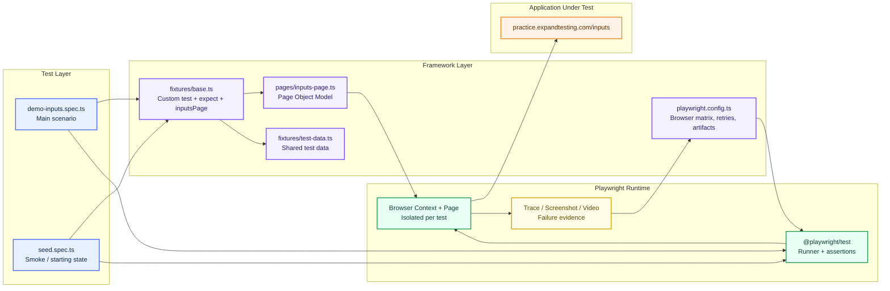
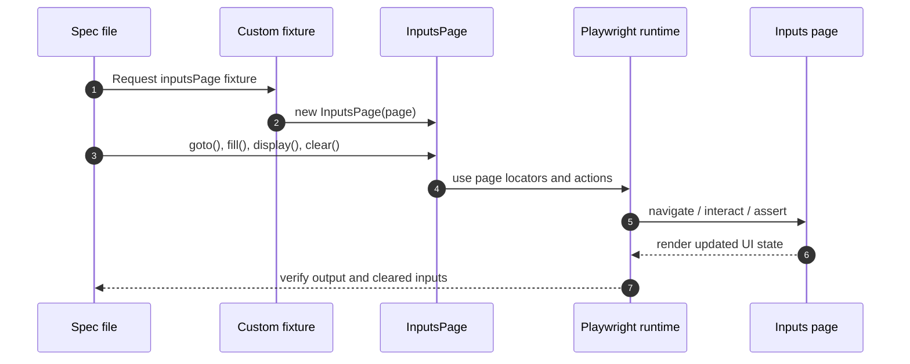

# Playwright TypeScript Architecture

This diagram explains the current framework in Selenium Java terms for someone used to a POM or hybrid framework.

## High-Level Architecture

## Selenium Java Mapping

| Selenium Java concept | Playwright TypeScript equivalent in this repo |
|---|---|
| `WebDriver` instance | `page` fixture from `@playwright/test` |
| `WebDriverWait` / explicit waits | Playwright auto-waiting built into locators and actions |
| `Page Object` class | `pages/inputs-page.ts` |
| `BaseTest` / custom test setup | `fixtures/base.ts` |
| Test data class / config | `fixtures/test-data.ts` and `playwright.config.ts` |
| TestNG/JUnit runner | Playwright test runner |
| Screenshots / logs on failure | `trace`, `screenshot`, and `video` in config |
| Cross-browser execution | `projects` in `playwright.config.ts` |

## How The Flow Works

## Why This Is Different From Selenium Hybrid

In a Selenium hybrid framework, you usually see driver setup, wait utilities, page objects, test classes, and a separate data layer. This repo follows the same architectural idea, but Playwright collapses a lot of the boilerplate:

- No manual driver lifecycle in each test.
- No explicit wait utility for most UI actions.
- Locators are first-class and auto-wait by default.
- The fixture system replaces much of the classic base-class wiring.

## What We Adopted From The Production Architecture

The screenshots in the `production architecture/` folder show a heavier enterprise pattern with module boundaries, a flow layer, shared utilities, and module-owned page objects. This repo intentionally adopts only the parts that improve maintainability at its current size:

- A fixture-driven test object instead of inheritance.
- A thin `flows/` layer for scenario orchestration above the page object.
- Page objects that stay focused on locators and actions.
- Centralized test data instead of inline literals in specs.
- Config-driven runner behavior, retries, and failure artifacts.

What we are not copying yet:

- A large `src/` module tree.
- Module-per-product-line duplication.
- Shared base pages across unrelated areas.
- Extra utilities that do not earn their keep in a one-page demo suite.

The rule is simple: add structure only when the suite’s size makes it pay for itself.

## Current Repo Layout

- `tests/` contains the scenario specs.
- `fixtures/` contains the shared test wiring and test data.
- `pages/` contains page objects.
- `playwright.config.ts` controls browser matrix, retries, reporters, and artifacts.
- `playwright-report/` and `test-results/` are runtime outputs.

## Notes For A Selenium User

- Treat `page` like the Selenium browser session, but without the driver plumbing.
- Treat fixtures like a cleaner replacement for base classes and before/after setup.
- Treat locators like resilient element references, but with auto-waiting built in.
- Keep assertions in the spec file and page behavior in the page object, just like a good POM design.
- If the project grows, add more page objects, more fixtures, and more data files instead of putting everything into the spec.
